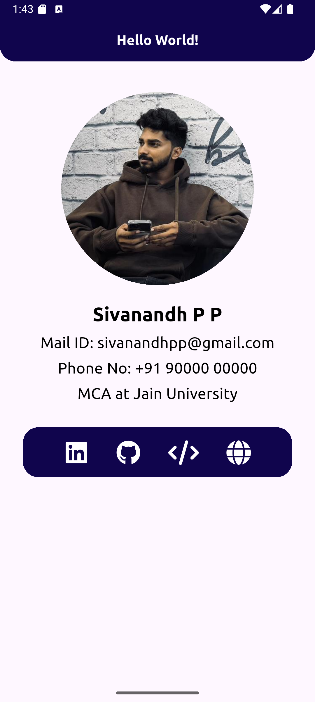

# HelloWorld

A cross-platform Flutter application showcasing a personal profile and social links.

## Table of Contents

- [Features](#features)
- [Screenshots](#screenshots)
- [Getting Started](#getting-started)
- [Installation](#installation)
- [Usage](#usage)
- [Built With](#built-with)
- [Contributing](#contributing)
- [License](#license)

## Features

- Modern UI with Flutter
- Personal profile display
- Social media links (LinkedIn, GitHub, LeetCode, Website)
- Responsive design for multiple platforms

## Screenshots

<!-- Add your screenshots to assets/images/ and reference them below -->

<!--  -->

## Getting Started

These instructions will get you a copy of the project up and running on your local machine for development and testing purposes.

### Prerequisites

- [Flutter SDK](https://flutter.dev/docs/get-started/install)
- Dart SDK (comes with Flutter)
- An IDE like VS Code or Android Studio

### Installation

1. **Clone the repository:**
   ```sh
   git clone https://github.com/sivanandhpp/helloworld.git
   cd helloworld
   ```

2. **Install dependencies:**
   ```sh
   flutter pub get
   ```

3. **Run the app:**
   ```sh
   flutter run
   ```

## Usage

- Launch the app on your preferred device or emulator.
- Explore the profile and use the social media buttons to visit external links.

## Built With

- [Flutter](https://flutter.dev/)
- [Dart](https://dart.dev/)
- [Google Fonts](https://pub.dev/packages/google_fonts)
- [Font Awesome Flutter](https://pub.dev/packages/font_awesome_flutter)
- [url_launcher](https://pub.dev/packages/url_launcher)

## Contributing

Contributions are welcome! Please open issues and submit pull requests for improvements.

## License

This project is licensed under the MIT License - see the [LICENSE](LICENSE) file for details.